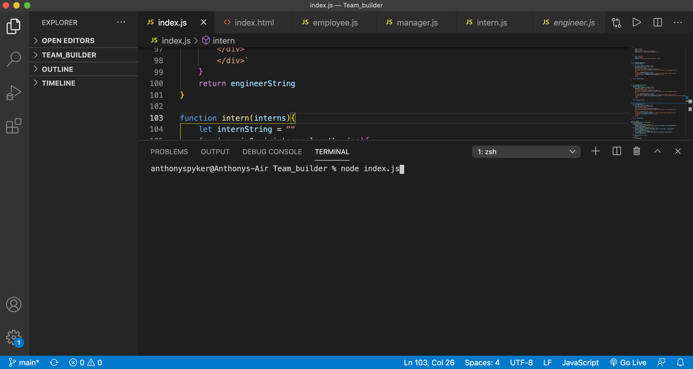
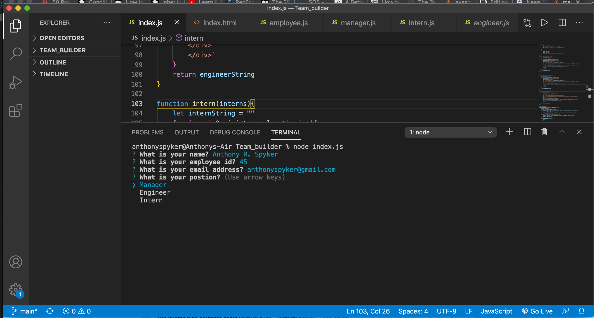
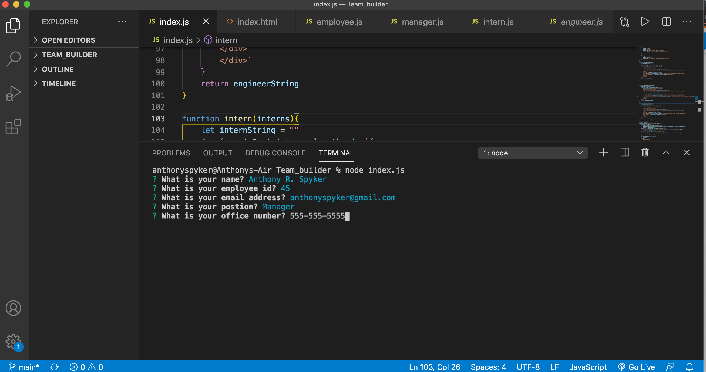
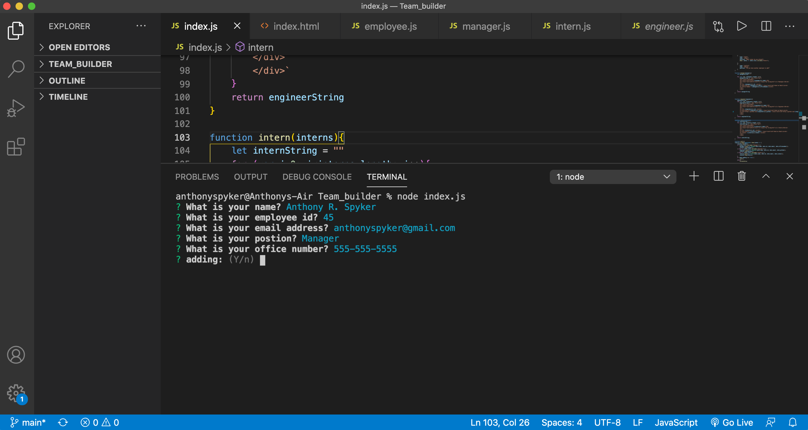
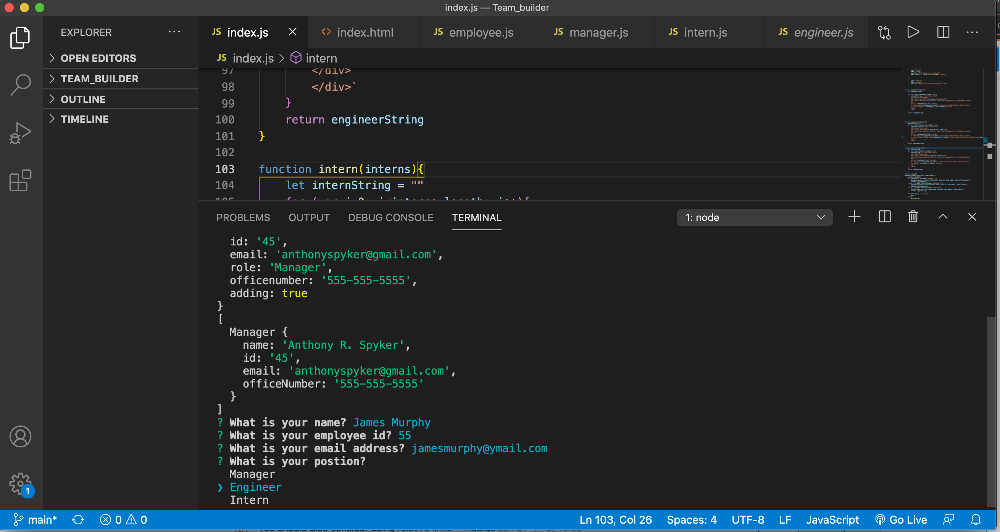
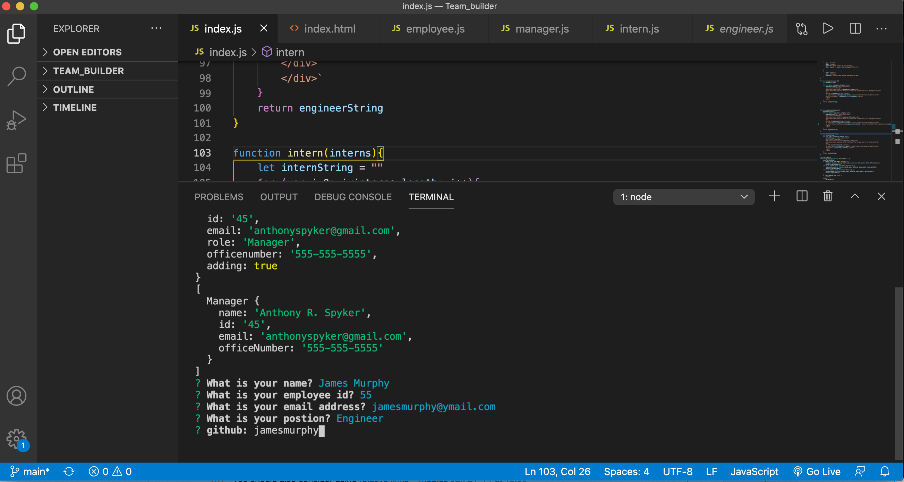
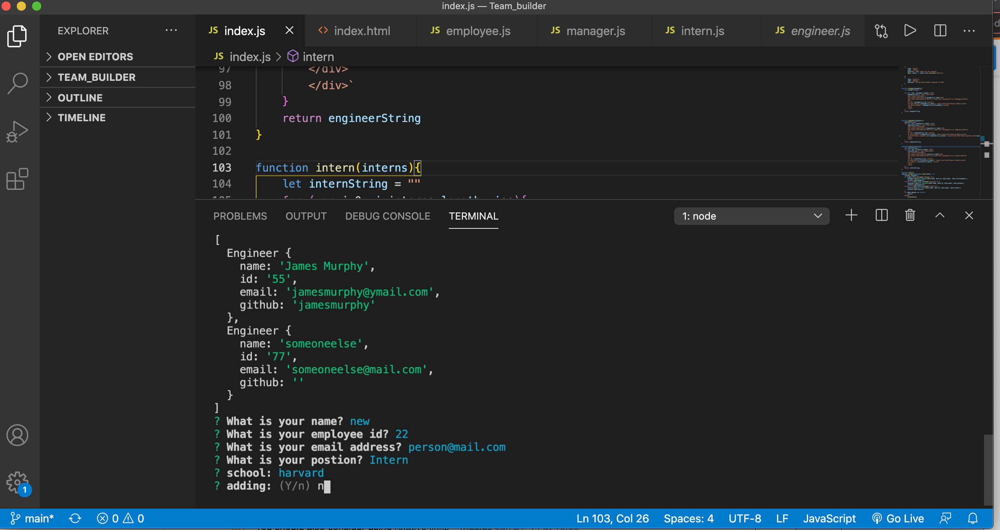
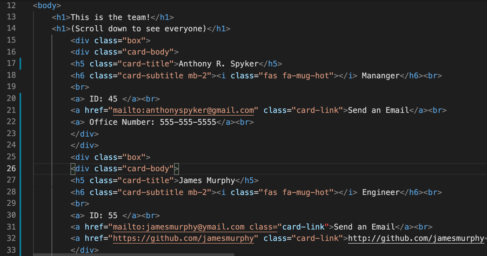
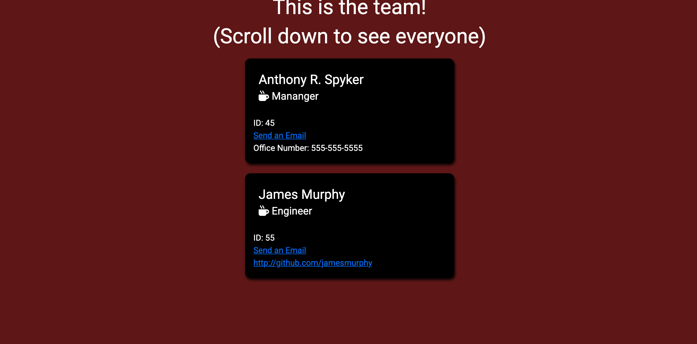

# Team_builder

  This site builds a website that lists all individuals on a team.  When ready to run, the user is prompted to information about team members and there work class.  When the user does not wish to enter any more team members they can end the interface interactions and render a fully dynamic HTML page with CSS stylings.  
  This site is fully supprted by javascript, and node.js inquirer package.
  
## Use:

  The user must start by downloading the repository from this site.  Once this is done the user must install node.  This is done by sending "npm init" in order to install the package.json.  After this is installed the user must then require the inquirer package from npm.  This is done by typing "npm i install".  Now the user is full ready to use the Team_builder.
  
The user begins by opening up their terminal.  Here they type in "node index.js".

Next the user will be prompted with a series of questions as to a name, an employee id and a email address.

the user will be given options as to describe the employees position (manager, engineer or intern).  Once that question is answered a dynamic question will be asked depending on what position the user entered.  That is, a manager will be asked for there manager number, the engineer will be asked for their github page, and the intern will be asked what school they go to.  

The user will then be prompt if they have any more employees they want to enter.  The following images show what it looks like when an alternate question in answered.

Below we see the info for the engineer being entered.  

In the following images all of the info has been entered and we have decided to no longer enter any more info so the user selects 'no' to render the page.

Below we see the html that was dynamically rendered from the end of the infromation request.

Finally we see the dynamically rendered web page from the html.

## Technologies used
  This is fully integrated using npm inquirer and node.js.  The interfaces were created using bootstrap as well some of the images used were taken from font Awesome.  
  
## Moving Forward
  In the future we would like to see that this site has more at work capabilities like possibly be turned into a time clock and storage for hours of employess.
  
## Contributions
  This site was independently created but if there is any wish to add to it, forking is welcome and all push requests will be considered.
  
  
  Thank you for checking out my page!

